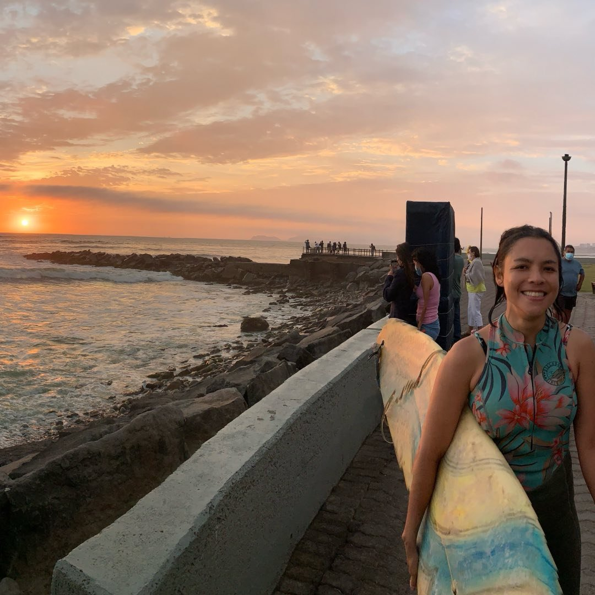

## 
Hello!

I'm Sandra Romero Pinto. I'm currently a Ph.D. student at Harvard University, in the [SHBT](https://shbtphd.hms.harvard.edu/) program of the [Division of Medical Sciences](https://gsas.harvard.edu/programs-of-study/divisions/division-medical-sciences). 

I'm advised by [Naoshige Uchida](https://projects.iq.harvard.edu/uchidalab/home). I'm interested in *learning*, and in particuliar, how  we learn to associate a certain value (or utility) to elements we encounter in our environment, and how our model of the world becomes influenced or constrained by this subjective utility.  My research  applies concepts of reinforcement learning, economics, and computational psychiatry, in the neuroscience of learning. I was recently awarded the Albert J. Ryan Fellowship by Harvard Medical School due to my dissertation research.

Previously I did a Master of Science in [Bioengineering](https://www.epfl.ch/education/master/programs/life-sciences-engineering/) at [EPFL](https://www.epfl.ch/en/), where I spend two years learning about neuroenineering and neuroprosthetics, and also developed some fun projects.
Before that, I did a Bachelors in Biomedical Engineering, in between [Politecnico di Milano](https://www2.polimi.it/index.html%3Fid=9025&L=1.html) and [Tecnologico de Monterrey](https://tec.mx/en/innovation-and-transformation/bs-in-biomedical-engineering). 

Also! I'm from Peru and I grew up *very* near the Pacific Ocean. It should be mentioned that I'm slightly addicted to surfing.

Thanks for dropping by!
